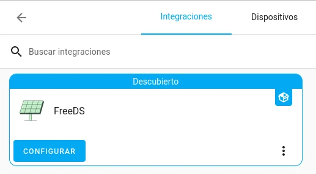
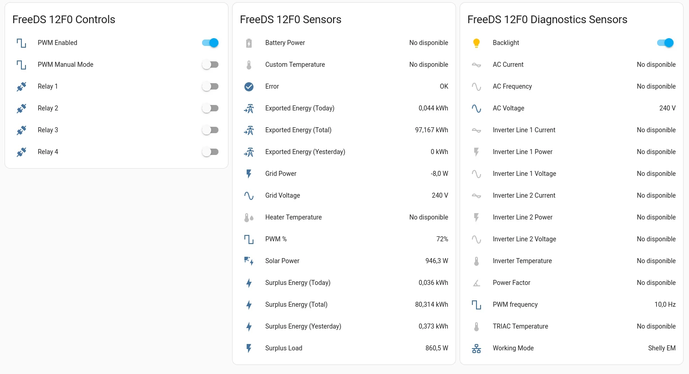

# homeassistant-freeds

`homeassistant-freeds` is a [Home Assistant](https://www.home-assistant.io) integration for [FreeDS](https://freeds.es/) devices (power surplus management devices).

This repository also contains a [custom dashboard card](https://developers.home-assistant.io/docs/frontend/custom-ui/custom-card/) for home assistant - a "power flow" graph similar to the one found in FreeDS.

## Installation

#### Guided installation

- Enable the [HACS](https://hacs.xyz/) integration in your Home Assistant instance.
- Use the side menu to browse HACS.
- Navigate to "Integrations", then use the overflow menu (three dots at the top-right) to add a Custom Repository.
- Enter the URL `https://github.com/IvanSanchez/homeassistant-freeds`, of type "Integration"
- You should see a new box labelled "FreeDS". Click on it and follow HACS' instructions to download and enable the integration.
- Restart Home Assistant when HACS tells you to.

#### Manual installation

Download the files from this repository. Copy the `custom_components/freeds/` directory into the `custom_components` directory of your Home Assistant instance.

e.g. if your configuration file is in `/home/homeassistant/.homeassistant/configuration.yaml`, then the files from this integration should be copied to `/home/homeassistant/.homeassistant/custom_components/freeds/`.

Restart Home Assistant to ensure the integration can be detected.

## Usage

In Home Assistant, go to "Settings", then "Devices & Services".

If your FreeDS is in the same local network than your Home Assistant, then it should be automatically detected:



If your FreeDS is **not** automatically detected , then click on "add new integration" at the bottom, and search for "FreeDS".

Confirm the IP address (or hostname) of your FreeDS device, as well as the HTTP port (always `80`, unless you know what "NAT" and "port forwarding" means). Confirm username/password if needed (the firmware defaults to "admin"/"admin").

This has been tested with FreeDS firmware version 1.0.7rev2 and 1.1.0-beta16.

Home Assistant should display a new *Device* with seven *Switches* (for PWM management, relay toggling, and backlight), and a couple dozen *Sensors*, such as:



This integration creates one entry for every *possible* value that FreeDS *might* report. Depending on the working mode of your FreeDS there might be a lot of "unavailable" values. This is normal. If this bothers you, then keep in mind that it's possible to disable those in settings → devices & services → entities.

## Bugs? Comments?

Use the gitlab issue tracker at https://gitlab.com/IvanSanchez/homeassistant-freeds/-/issues

(Yes, it's Git**Lab** and not Git**Hub**. Development happens at GitLab. The GitHub repo is only for HACS compatibility.)

Please keep in mind that it's an issue tracker, and not a discussion forum. I recommend reading ["How to Report Bugs Effectively"](https://www.chiark.greenend.org.uk/~sgtatham/bugs.html) if you've never written into an issue tracker before.

Please provide any Home Assistant logs. It's a good idea to increase the verbosity of the logs for the `freeds` integration by adding this to yout `configuration.yml` file (as explained at https://www.home-assistant.io/integrations/logger/ ):

```yaml
logger:
  default: warning
  logs:
    custom_components.freeds: info
```

## License

Licensed under GPLv3. See the `LICENSE` file for details.
