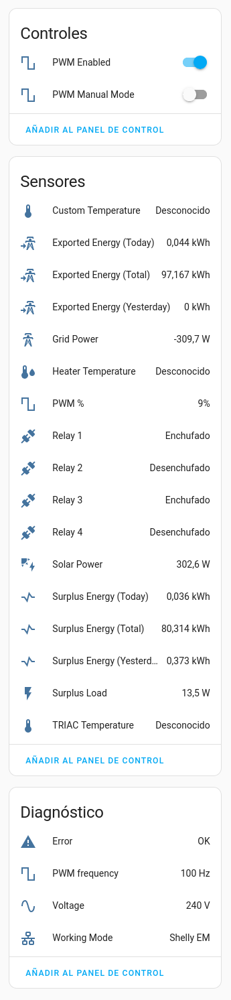

# homeassistant-freeds

`homeassistant-freeds` is a [Home Assistant](https://www.home-assistant.io) integration for [FreeDS](https://freeds.es/) devices (power surplus management devices).

## Installation

#### Guided installation

- Enable the [HACS](https://hacs.xyz/) integration in your Home Assistant instance.
- Use the side menu to browse HACS.
- Navigate to "Integrations", then use the overflow menu (three dots at the top-left) to add a Custom Repository.
- Enter the URL `https://github.com/IvanSanchez/homeassistant-freeds`, of type "Integration"
- You should see a new box labelled "FreeDS". Click on it and follow HACS' instructions to download and enable the integration.
- Restart Home Assistant when HACS tells you to.

#### Manual installation

Download the files from this repository. Copy the `custom_components/freeds/` directory into the `custom_components` directory of your Home Assistant instance.

e.g. if your configuration file is in `/home/homeassistant/.homeassistant/configuration.yaml`, then the files from this integration should be copied to `/home/homeassistant/.homeassistant/custom_components/freeds/`.

The integration needs the [`getmac` pypi module](https://pypi.org/project/getmac/), so you'll probably need to install it within homeassistant's virtualenv. In other words:
- Activate HASS virtualenv (likely running `cd /srv/homeassistant` then `source bin/activate`)
- Install `getmac` (run `pip3 install getmac`)

Restart Home Assistant to ensure the integration can be detected.

## Usage

Use the Home Assistant GUI to add a new integration (settings → devices & services → add new integration). You should find the FreeDS integration in the list.

Enter the IP address (or hostname) of your FreeDS device. Note that **no checks are made to ensure that there is a FreeDS device at that IP address**.

Home Assistant should display a new *Device* with a dozen *Sensors*, such as:

## Bugs? Comments?

Use the gitlab issue tracker at https://gitlab.com/IvanSanchez/homeassistant-freeds/-/issues

(Yes, it's Git**Lab** and not Git**Hub**. Development happens at GitLab. The GitHub repo is only for HACS compatibility.)

Please keep in mind that it's an issue tracker, and not a discussion forum. I recommend reading ["How to Report Bugs Effectively"](https://www.chiark.greenend.org.uk/~sgtatham/bugs.html) if you've never written into an issue tracker before.

## License

Licensed under GPLv3. See the `LICENSE` file for details.
